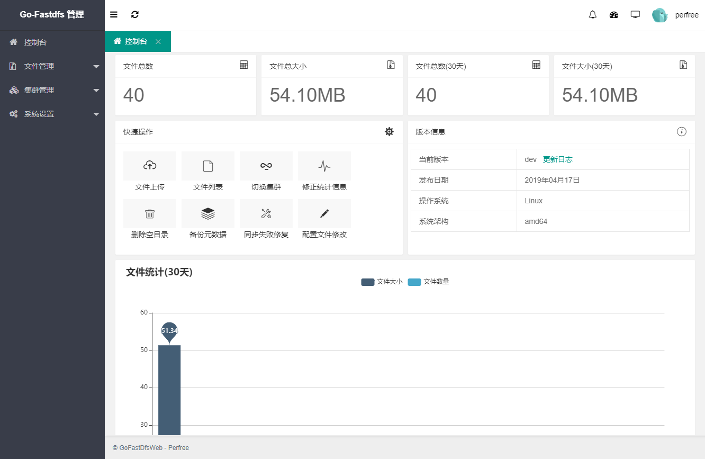
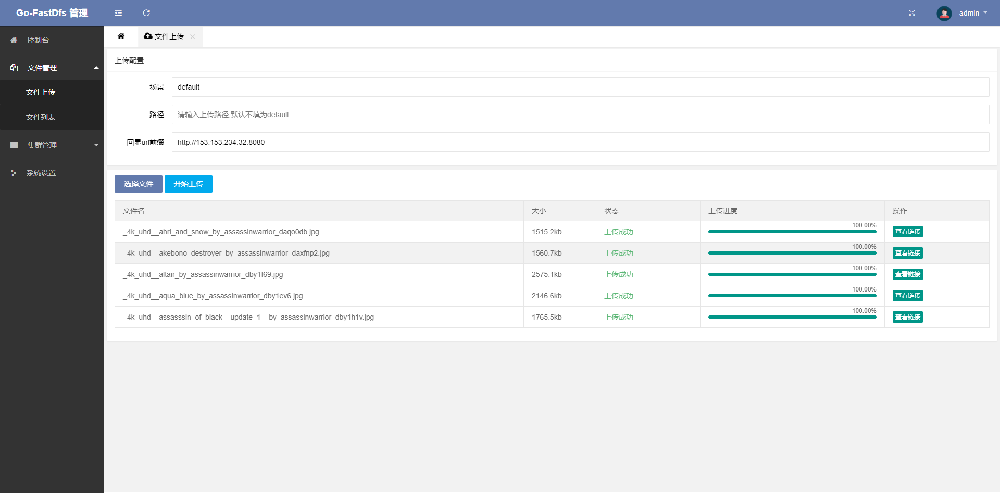
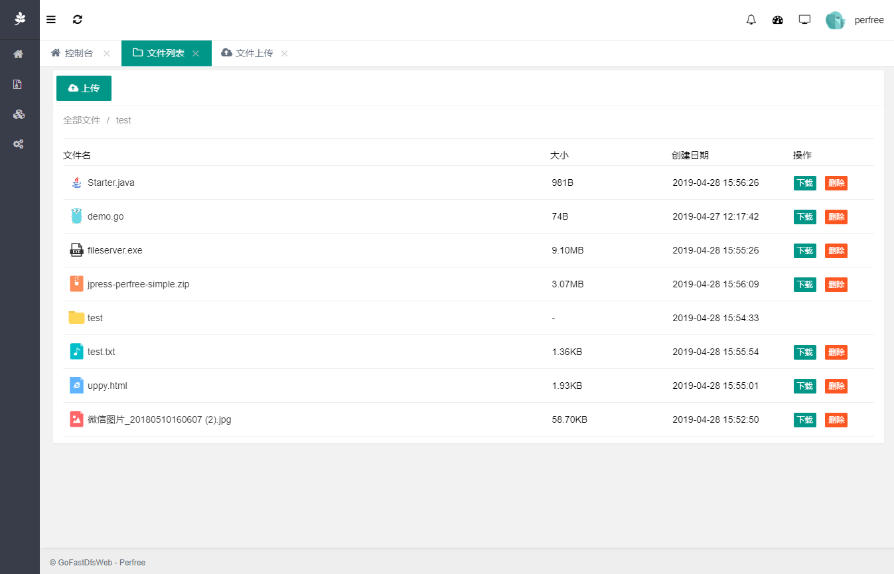
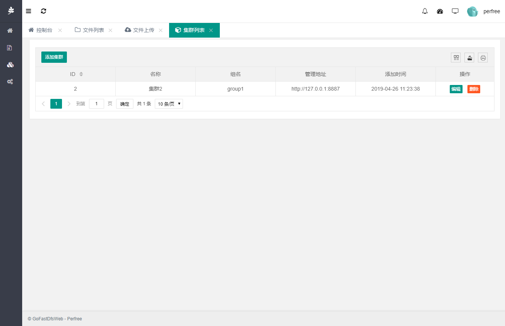

## Go-Fastdfs web管理平台
> go-fastdfs 是一个简单的分布式文件存储，具有高性能，高可靠，免维护等优点，支持断点续传，分块上传，小文件合并，自动同步，自动修复。本项目为go-fastdfs的web管理端

[前往 Go-Fastdfs](https://github.com/sjqzhang/go-fastdfs)

## 简单预览图








## 注意事项
1. 默认端口8088,修改默认端口号更改config/application-prod.properties即可
2. 如go-fastdfs开启了按组管理,则需要填写组名,反之不用填写
3. 进入安装页填写集群地址时,该地址需要在go-fastdfs配置文件配置管理ip白名单,否则获取不到数据!
4. 文件列表功能需要go-fastdfs服务版本在v1.2.8以上
5. 遇到获取不到信息的功能,先试一下本地调用go-fastdfs接口看是否能获取到

## 运行步骤
共提供三个版本,无环境版(需要自己安装java运行环境),Windows自带JRE环境版,Linux自带JRE环境版
[下载地址](https://github.com/perfree/go-fastdfs-web/releases)

### 无环境版(Windows运行)
解压压缩包后,直接运行start.bat
### 无环境版(Linux运行)
解压压缩包后,运行脚本,命令如下:
```
1.运行
./goFastDfsWeb.sh start
2.查看运行状态
./goFastDfsWeb.sh status
3.重新启动
./goFastDfsWeb.sh restart
4.停止
./goFastDfsWeb.sh stop
```
### Linux自带JRE环境版
解压压缩包后,运行脚本,命令如下:
```
1.运行
./goFastDfsWeb.sh start
2.查看运行状态
./goFastDfsWeb.sh status
3.重新启动
./goFastDfsWeb.sh restart
4.停止
./goFastDfsWeb.sh stop
```
### Windows自带JRE环境版
解压压缩包后,直接运行start.bat

## 开发说明
项目使用SpringBoot,Mybatis,Shiro进行开发,为方便后期用户安装,数据库采用Sqlite,为了代码的简洁,使用了lombok插件,请在开发前提前安装.
开发前请先将application.properties中的spring.profiles.active=prod改为dev环境,之后参照application-dev.properties进行配置

## 打包方式
1. 将application.properties配置文件中spring.profiles.active的值改为prod
2. maven运行mvn clean package
3. 完成之后得到jar,zip,tar.gz三种格式文件