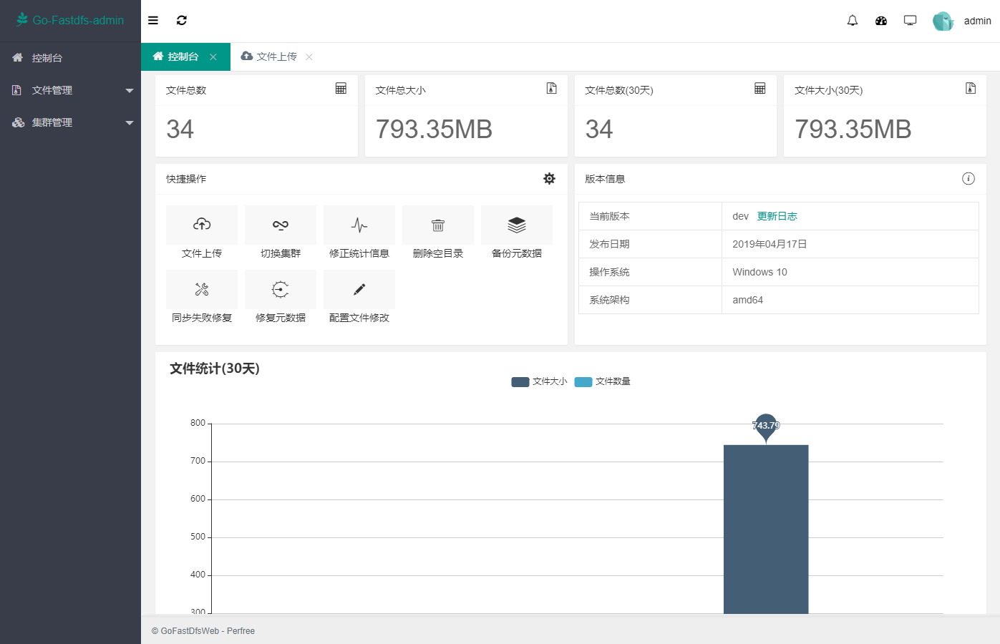
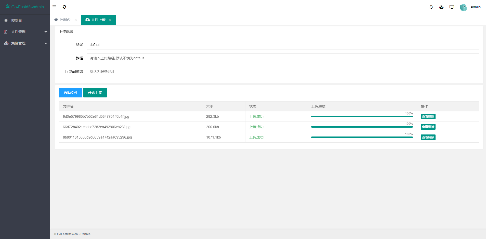

## Go-Fastdfs web管理平台(开发中...)
[前往 Go-Fastdfs](https://github.com/sjqzhang/go-fastdfs)

## 简单预览图(开发中)

## 开发说明
项目使用SpringBoot,Mybatis,Shiro进行开发,为方便后期用户安装,数据库采用Sqlite,为了代码的简洁,使用了lombok插件,请在开发前提前安装.

## 运行步骤
将项目导入sts或者IDEA,修改application.properties配置文件中db文件的地址,直接运行Application即可,默认端口8888,首次访问将进入安装页面,请按照提示填写go-fastdfs服务地址(需在go-fastdfs中设置白名单),填写用户名,密码,即可进行访问
## 打包方式
1. 将application.properties配置文件中db文件的地址改为pro环境
2. maven运行mvn clean install
3. 得到jar包后,在jar包同级目录新建config目录,将项目中所有的properties文件拷贝进去
4. 在jar同级目录新建db目录,将项目中go-fastdfs.db文件拷贝进去
5. 直接java -jar go-fastdfs-web-1.0.0.jar运行即可
ps:后期会更改打包方式

写在最后,项目开发完毕将打包为可执行文件,免除用户任何环境的安装,以达到同go-fastdfs使用简便的目标